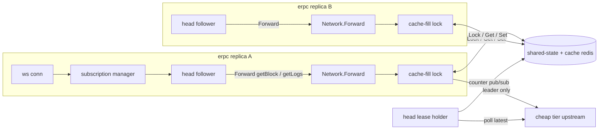

# Plan 002: venn parity for indexing workloads

> **Executor instructions**: Read the whole plan before starting. Workstreams
> W2 to W6 run in parallel once W1 has landed. Each workstream owns the files
> listed under it; do not edit another workstream's files without
> coordinating. Run the verification commands for your workstream and paste
> the result in your report. Honor the STOP conditions. When done, update the
> status row in `plans/README.md`.
>
> **Drift check (run first)**:
> `git diff --stat 989cfe60..HEAD -- common/ erpc/ data/ architecture/evm/ internal/policy/ typescript/config/src/`
> If any file cited under "Current state" changed, re-read it before editing.

## Status

- **Priority**: P1 (blocks moving gfx-labs indexers from venn to erpc)
- **Effort**: L
- **Risk**: MEDIUM. All features are opt-in and default-off. The one shared
  refactor is extracting the per-request pipeline out of the HTTP handler
  closure (W6).
- **Depends on**: none
- **Planned at**: commit `989cfe60` (gfx-labs/erpc `main` == erpc/erpc `main`), 2026-09-25
- **Branch**: `feat/venn-features`
- **Background**: `gfx-labs/venn` `docs/erpc-migration-assessment.md`

## Why this matters

gfx-labs runs [venn](https://github.com/gfx-labs/venn) in front of its
indexers. We want to move to erpc, but four venn behaviors are load-bearing for
cost and for client compatibility:

| # | Requirement | erpc today |
|---|---|---|
| R1 | A cache miss hits **one** remote, even across N erpc replicas | Per-process multiplexing only. Hedge fans out by default. No cross-replica coordination. |
| R2 | Try **every** upstream in the cheap tier before any upstream in the next tier | `preferTag` returns one tier only. The fallback tier is not in the request's list, so a request that exhausts the cheap tier fails instead of falling through. |
| R3 | `eth_subscribe` over websocket (`newHeads`, `logs`), synthesized by polling | Absent. No inbound WS, no outbound WS client, no synthesis. |
| R4 | Head state is shared, so replicas do not each pay for head polling and head payloads | Head block *numbers* are shared counters, but every replica still polls every upstream. Head payloads are cached only if a request happens to populate them. |

Every feature in this plan is opt-in. No existing default changes.

## Design principles for this plan

- **Weakest design that fits** (see `AGENTS.md`). No method lists, no chain
  or vendor special cases. Unknown methods take the same path as known ones.
- **Fail open.** Every piece of shared coordination (locks, leases, waits)
  degrades to today's behavior when the shared-state connector is slow or
  down. Coordination may cost latency up to a configured bound; it must never
  turn into an error the client would not have seen before.
- **Reuse, do not add, transport.** Cross-replica signaling goes through the
  existing shared-state connector (`Lock`, `Get`/`Set`, counter pub/sub). No
  new pub/sub channel type.
- **Pull, not push, for payloads.** Head payloads are fetched on demand
  through `Network.Forward`, so they reuse cache, multiplexing, selection, and
  R1's fill lock. R1 plus a realtime cache policy is what makes one replica
  pay per block. There is no separate prefetcher and no payload store.

## Current state (verified at `989cfe60`)

### Request path

- `erpc/networks.go:1800` `Network.Forward`: static responses, then safe-block
  routing, then `handleMultiplexing` (`:1860`), then cache `Get` (`:1880-1897`),
  then `policyEngine.GetOrderedInLane` (`:1900-1925`), then failsafe execution,
  then async cache `Set` in a goroutine (`:2482-2515`).
- `erpc/networks.go:3107-3144` `handleMultiplexing`: in-memory
  `inFlightRequests` keyed by `req.CacheHash()`. Per process only.
- `erpc/multiplexer.go`: leader/follower response cloning.
- `common/defaults.go:124-141`: the system template (used when no `projects`
  block exists) sets network hedge `maxCount: 2` and retry `maxAttempts: 5`.

### Shared state

- `data/connector.go:17-50`: `Connector` has `Lock(ctx, key, ttl)`,
  `Get/Set/Delete`, `WatchCounterInt64`, `PublishCounterInt64`.
  `DistributedLock` only has `Unlock` and `IsNil`.
- `data/redis.go:471-560`: redsync mutex. Lock acquisition retries until
  `min(ctx deadline - 10s buffer, ttl)`. A short ctx deadline gives try-lock
  behavior.
- `data/memory.go:180-215`: per-key `sync.Mutex`, honors ctx.
- `data/shared_state_registry.go:38-42`: `SharedStateRegistry` exposes
  counters only. Keys are prefixed `<clusterKey>/`.
- `data/shared_state_variable.go:430-500`: `TryUpdateIfStale` skips the fetch
  when the counter is fresh. Remote updates advance the freshness timestamp
  (`processNewState`, `:124-170`), so replicas already partly dedupe latest-block
  polls. The dedupe is best-effort and racy: every replica whose local view goes
  stale in the same window still polls.
- `upstream/registry.go:160-167`: `UpstreamsRegistry.SharedStateRegistry()`
  accessor. `Network` reaches shared state through it.

### Head polling

- `architecture/evm/evm_state_poller.go:285` `Poll` runs per **upstream**, per
  replica, every `statePollerInterval` (default 30s, `common/defaults.go:2026-2030`)
  plus on demand through `TryUpdateIfStale` with a block-time-derived debounce
  (`DefaultEvmStatePollerDebounce` 5s fallback, `common/defaults.go:2379`).
- `:451-532` `PollLatestBlockNumber` fetches `eth_getBlockByNumber("latest")`
  and increments `erpc_upstream_latest_block_polled_total`.
- `erpc/networks.go:791` `EvmHighestLatestBlockNumber` returns the served tip
  (majority head, `common/served_tip.go`).

### Selection policy

- `common/config.go:2741-2776` `SelectionPolicyConfig.EvalFunc`: JS
  `(upstreams, ctx) => Upstream[]`, evaluated per tick (`internal/policy/slot.go:123-171`).
  Requests read the cached order (`internal/policy/engine.go:372-390`).
- `internal/policy/stdlib/stdlib.js:931-953` `preferTag`: returns the matching
  subset, or the fallback subset, never both.
- `internal/policy/default_policy.js`: health excludes, then
  `preferTag('!tier:fallback', ...)`, then `sortByScore`, then `stickyPrimary`,
  then `probeExcluded`.
- `common/request.go:1409-1450` `NextUpstream`: walks the request's list in
  order. One failsafe attempt sweeps the whole list
  (`erpc/networks.go:2153-2354`).
- `typescript/config/src/types/policyEval.ts:228-524`: TS typings for stdlib steps.

### HTTP server

- `erpc/http_server.go:151-160`: handler chain is
  `createRequestHandler` -> optional `gzipHandler` -> `TimeoutHandler` -> optional
  gRPC dispatch -> `h2c`. `TimeoutHandler` and `gzipHandler` wrap the
  `ResponseWriter`, so a hijack for a websocket upgrade must happen outside them.
- `erpc/http_server.go:246-865`: one closure does URL parsing, CORS, body
  read, batch split, and the per-request pipeline (validate, forward headers,
  ignore/allow methods, auth, trusted user header, network resolve, directives,
  `project.Forward`).
- `go.mod:13`: `github.com/coder/websocket v1.8.15` is already a dependency
  (used by `internal/simulator/ws.go`).
- `clients/registry.go:100-101`: outbound `ws://` upstreams return
  `websocket client not implemented yet`. Out of scope, see Non-goals.

### Cache

- `common/cache_dal.go`: `CacheDAL` has `Get`, `Set`, `IsObjectNull`. No `Delete`.
- `architecture/evm/json_rpc_cache.go:630` `Set`, `:1030` `findSetPolicies`,
  `:1055` `findGetPolicies`, `:1235-1249` key layout
  (`<networkId>:<blockRef>` / `CacheHash`).
- `data/cache_policy.go:82-169`: `realtime` and `unfinalized` are cacheable
  finalities. No reorg invalidation, only TTL plus the realtime age guard.
- `architecture/evm/json_rpc_cache.go:646-647`: TODO about
  subscription-driven cache population.

## Target design



### F1. Cross-replica cache fill (R1)

New network config block:

```yaml
networks:
  - architecture: evm
    evm: { chainId: 1 }
    cacheFill:
      # Coordinate cache misses across replicas through the shared-state connector.
      enabled: true
      # How long the winning replica holds the fill lock. Must exceed a slow upstream call.
      lockTtl: 30s
      # How long a losing replica waits for the winner's result before calling upstream itself.
      maxWait: 5s
      # How often a waiting replica re-checks the cache.
      pollInterval: 50ms
      # Upper bound on lock acquisition. Anything slower is treated as "shared state unavailable".
      lockAcquireTimeout: 100ms
```

Behavior, inserted in `Network.Forward` after the cache miss and before
upstream selection (`erpc/networks.go:1897`), only when all hold:
`cacheFill.enabled`, `n.cacheDal != nil`, `!req.ShouldSkipCacheRead("")`, and
this request is the multiplexing leader (or multiplexing is off). Followers of
the local multiplexer never touch the lock, so each replica takes at most one
lock per key.

1. Key: `<clusterKey>/cachefill/<networkId>/<cacheHash>` (reuse `multiplexKey`).
2. Try-lock with `ctx` bounded by `lockAcquireTimeout`.
   - **Won**: forward to upstream as today. When the response is cacheable,
     run the cache `Set` **synchronously** (today it is async) before
     releasing, then write a done marker
     `<key>/done = {"s":"stored"}` with TTL `2 * pollInterval + maxWait`. If the
     response is an error, empty-and-not-cached, or `Set` fails, write
     `{"s":"uncached"}`. Release the lock. Response latency to the winner's
     client grows by one cache write. That is the price of R1.
   - **Lost** (lock held elsewhere): loop every `pollInterval` until `maxWait`:
     `cacheDal.Get`, hit means return it (mark `FromCache`, and close the local
     multiplexer with it). Otherwise read the done marker. `uncached` means
     stop waiting and forward to upstream now. On `maxWait`, forward to upstream.
   - **Lock error / timeout / shared state is memory-only**: forward as today.
     Log at debug, count it.
3. The synchronous `Set` path must reuse the existing `Set` goroutine body
   (panic recover, 10s timeout, `DoneRef`) so the async path and the sync
   path cannot drift. Extract it into `n.storeInCache(ctx, req, resp) error`.

Why a marker plus polling instead of pub/sub: the shared-state pub/sub today
carries counters only (`data/redis_pubsub_manager.go:154-168`). Polling the
cache that we already read is the weakest mechanism that works, and it needs
no new message type. Polling cost is bounded: waiters per key per replica is
at most 1 (multiplexer), and `maxWait / pollInterval` Gets each.

Consequence the docs must state: R1 only holds for responses that a cache
policy stores. If the realtime/unfinalized policies are missing, every
replica still fetches head data once.

Also required for R1, config only (docs + example, no code): set network
failsafe `hedge.maxCount: 0` or omit hedge, and no `consensus`. Keep
`integrity.autoCorrectWhenPossible` off. These are documented in the example
config under F5.

### F2. Ordered tiers in the selection policy (R2)

New stdlib step `orderByTiers(patterns, opts)`:

```js
(upstreams, ctx) =>
  upstreams
    .removeCordoned()
    .excludeIf(any(blockNumberLagAbove(16), blockSecondsLagAbove(30)))
    .excludeIf(all(samplesAbove(10), errorRateAbove(0.7)))
    .whenEmpty(() => upstreams)
    .sortByScore(PREFER_FASTEST)
    // Cheap tier first, then mid, then everything else. Order inside a tier is the incoming order.
    .orderByTiers(['tier:cheap', 'tier:mid'])
```

Semantics: stable partition. Output is every upstream matching `patterns[0]`
(input order kept), then every upstream matching `patterns[1]` not already
emitted, and so on, then the unmatched remainder unless
`opts.rest === 'drop'`. Patterns use the same `hasMatchingTag` glob as
`preferTag` (`!` negation supported). Nothing is removed unless `rest: 'drop'`,
so a request that exhausts the cheap tier falls through to the next tier
inside the same failsafe attempt, because the sweep walks the whole list
(`erpc/networks.go:2153-2354`).

Option `opts.within`:
- `'keep'` (default): keep incoming order inside each tier (so
  `sortByScore` before it decides the order).
- `'rotate'`: rotate each tier's start by one position per tick, for coarse
  load spreading across a tier, similar to venn's round-robin within a
  priority (`gfx-labs/venn lib/callcenter/cluster.go:76-119`). Per-tick, not
  per-request, because eval is tick-based. Document this limit.

Do **not** chain `stickyPrimary` after `orderByTiers`: it may pull an
upstream from a later tier to position 0. Validation should warn (not fail)
when a policy source contains `orderByTiers` followed by `stickyPrimary`.
Detect by substring order on `EvalFuncOriginal`; that is enough for a warning.

Files: `internal/policy/stdlib/stdlib.js` (next to `preferTag`),
`typescript/config/src/types/policyEval.ts` (typing next to `preferTag`,
`PreferOptions` sibling `OrderByTiersOptions`), docs.

### F3. Leased head polling (R4, head numbers)

New network config:

```yaml
evm:
  headPolling:
    # "all" (default, current behavior) or "lease".
    mode: lease
    # Lease length. The holder renews at leaseTtl / 3.
    leaseTtl: 10s
    # A non-holder polls anyway when the shared counter has not advanced for this long.
    staleAfter: 3x the poller debounce (default when zero)
```

With `mode: lease`, one replica per network holds a lease
`<clusterKey>/headlease/<networkId>` in the shared-state connector. Inside
`PollLatestBlockNumber` and `PollFinalizedBlockNumber`, the fetch closure
passed to `TryUpdateIfStale` first asks a `HeadLease` whether this replica
may poll:

- holder: poll as today; the existing counter push publishes the value to all
  replicas.
- non-holder: return the current value without an upstream call, **unless**
  the counter's last update is older than `staleAfter`, in which case poll
  (fail-open when the holder dies or shared state is down). Count skips.

Lease mechanics (`data/lease.go`, new):

- Acquire: `connector.Lock(ctx, key, leaseTtl)` with a short ctx.
- Renew: add optional interface `ExtendableLock { Extend(ctx, ttl) (bool, error) }`.
  Implement it for redis via redsync `ExtendContext`. For connectors
  without it, re-acquire after expiry; a short gap or overlap only means a
  few extra or missing polls, covered by `staleAfter`.
- One background loop per network per replica, started in
  `Network.Bootstrap` when `mode: lease` and shared state is not memory-only.
  With a memory connector, log once and behave like `all`.
- Gauge `erpc_network_head_lease_held{project,network}` 1/0.

The `HeadLease` is passed to the poller through the upstream's network
config lookup, not through a new constructor argument, to avoid touching every
`NewEvmStatePoller` call site. Concretely: `EvmStatePoller` gets a setter
`SetHeadLease(common.HeadLease)` called by the network bootstrap for each of
its upstreams (and again when upstreams are added). A nil lease means `all`.

This keeps the existing shared counter protocol unchanged, so `v2` counter
schema, rollback handling, and served-tip math are untouched.

### F4. Websocket transport and synthetic subscriptions (R3, R4 payloads)

#### F4a. Transport (`erpc/ws_server.go`, new)

Config:

```yaml
server:
  websocket:
    enabled: true
    # Per-connection cap on live subscriptions.
    maxSubscriptionsPerConnection: 100
    # Concurrent in-flight non-subscription requests per connection.
    maxInflightPerConnection: 32
    # Outbound queue per connection. When full the connection is closed (slow consumer).
    sendQueueSize: 1024
    # Keepalive ping interval. Zero disables.
    pingInterval: 30s
    # Max inbound message size.
    maxMessageSize: 16MiB
```

- Same URL shapes as HTTP (`/<project>/evm/<chainId>`, aliasing). A request
  with `Connection: Upgrade` + `Upgrade: websocket` and websocket enabled is
  routed to the ws handler **before** `gzipHandler` and `TimeoutHandler`
  (`erpc/http_server.go:151-160`), because both wrap the `ResponseWriter`.
  Everything else takes the existing path unchanged.
- Accept with `coder/websocket`. After hijack, clear the read/write deadlines
  that `http.Server.ReadTimeout`/`WriteTimeout` set, otherwise every
  connection dies at `WriteTimeout`. Verify with a test that holds a
  connection past a 1s `WriteTimeout` (STOP condition if it cannot be made
  to pass).
- Auth: per message, same as HTTP, using the upgrade request's headers,
  query args, and remote addr. This keeps one auth path and applies
  per-method rate limits to every ws message.
- One reader goroutine, one writer goroutine with a bounded queue, a
  semaphore of `maxInflightPerConnection` for request handling. Queue full
  means close with status 1013 and count `reason="slow_consumer"`. The head
  fan-out never blocks on a client.
- Batch messages are supported: handle items concurrently, reply with one
  array, same as HTTP.
- Graceful shutdown: `HttpServer.Shutdown` closes ws connections with 1001.

#### F4b. Shared per-request pipeline (refactor in `erpc/http_server.go`)

Extract the body of the per-request goroutine
(`erpc/http_server.go:465-731`) into:

```go
func (s *HttpServer) handleSingleRequest(ctx context.Context, rc *requestScope, rawReq json.RawMessage) interface{}
```

`requestScope` holds what the closure captures today: project, isAdmin,
architecture, chainId, headers, queryArgs, the `*http.Request` for client IP
and remote addr, logger, startedAt. HTTP calls it from the existing loop.
The ws handler calls it per message. Behavior-preserving move only. The
existing `erpc/http_server*_test.go` suites are the regression gate.

`eth_subscribe` / `eth_unsubscribe` are intercepted **inside**
`handleSingleRequest` right before `project.Forward`, via an optional hook
on `requestScope` (`rc.subscriptions != nil`). On plain HTTP the hook is nil
and the methods are forwarded like any other method (today's behavior:
upstreams reject them). That way ignore/allow methods, auth, and rate limits
apply to `eth_subscribe` exactly as to other methods.

#### F4c. Subscription manager and head follower (`erpc/subscriptions*.go`, new)

Per network, lazily created on the first subscription, stopped when the last
one ends:

- **Head follower** goroutine. Every `tick` (network block time from the
  metrics tracker, clamped to [250ms, 2s], else 1s) read
  `n.EvmHighestLatestBlockNumber(ctx)`. Using the served tip means the follower
  only emits blocks that a majority of upstreams have, so indexer follow-up
  calls for that block do not hit "block not found". For each new height
  `last+1 .. head` (capped at `maxBackfill`, default 128, jump ahead and log
  when exceeded):
  1. `eth_getBlockByNumber(hex(n), false)` through `n.Forward`. This is the
     R1 path: with a realtime/unfinalized cache policy and `cacheFill`,
     only one replica pays per block.
  2. If `parentHash` does not match the hash emitted at `n-1`, reorg: walk
     back re-fetching by number with the `skip-cache-read` directive until the
     parent matches or `maxBackfill` is hit, emit `removed: true` logs for
     the orphaned blocks from the ring buffer, then emit the new branch.
     Count `erpc_subscription_reorgs_total`.
  3. If any `logs` subscription is live: `eth_getLogs({blockHash})` through
     `n.Forward`. One unfiltered call per block, shared by all subscribers
     and (through cache + fill lock) all replicas. Filter locally per
     subscription by address and topics, same rules as `eth_getLogs`
     (`gfx-labs/venn lib/ethtypes/filter.go` is a good reference; port the
     matching tests).
  4. Emit to subscribers. `newHeads` payload is the block object with
     `transactions` removed (geth shape).
  Ring buffer of the last `maxBackfill` blocks: number, hash, and logs,
  shared across subscriptions on that network.
- **Subscription registry**: `map[subId]*subscription` per connection and
  per network. Ids are 16 random bytes hex, `0x`-prefixed. Unsubscribe is
  idempotent and returns `true`/`false` like geth. Connection close removes
  its subscriptions.
- Supported kinds: `newHeads`, `logs`. Any other kind returns JSON-RPC error
  `-32601` `unsupported subscription type: <kind>`. This is the unknown-input
  path and gets a test first.
- Upstream errors inside the follower are logged and retried next tick. The
  follower never closes client connections.

Only the network's existing code paths are used for data, so selection
tiers (F2), cache, cache fill (F1), rate limits, and failsafe all apply.

#### F4d. Reorg-aware invalidation for follower keys

Add `Delete(ctx, req) error` to `common.CacheDAL` and implement it on
`EvmJsonRpcCache` (delete under every matching set policy's connector using
the same key derivation as `Set`) and on SVM as a no-op returning nil. The
follower calls it for the orphaned `eth_getBlockByNumber(n,false)` keys it
detects during a reorg walk-back. Client-issued keys for orphaned heights are
not purged; they expire by TTL. Docs must say so and recommend
`unfinalized` / `realtime` TTLs of a few block times.

### F5. Example config and docs

- `erpc.venn-parity.example.yaml` (new, repo root next to
  `erpc.svm.example.yaml`): redis shared state + redis cache with
  finalized / unfinalized / realtime policies, `cacheFill`, `headPolling:
  lease`, `server.websocket`, `orderByTiers` policy, hedge off, consensus off,
  upstreams tagged `tier:cheap` / `tier:fallback`. Must pass
  `erpc validate` (or the repo's config load test).
- Docs (agent-first conventions from `AGENTS.md`, exemplar
  `docs/pages/config/failsafe/hedge.mdx`):
  - `docs/pages/config/projects/cache-fill.mdx` (new, F1)
  - `docs/pages/config/projects/selection-policies.mdx` (add `orderByTiers`)
  - `docs/pages/config/projects/head-polling.mdx` (new, F3)
  - `docs/pages/operation/websocket.mdx` (new, F4)
  - `docs/pages/config/database/evm-json-rpc-cache.mdx` (reorg invalidation note)
  - `_meta.js` entries for new pages.
  Each new page gets the config schema table with defaults cited to
  `common/defaults.go`, numbered edge cases, and exact metric names.

## Config surface summary

All new, all default-off, all under existing blocks:

| Path | Type | Default |
|---|---|---|
| `server.websocket.enabled` | bool | `false` |
| `server.websocket.maxSubscriptionsPerConnection` | int | `100` |
| `server.websocket.maxInflightPerConnection` | int | `32` |
| `server.websocket.sendQueueSize` | int | `1024` |
| `server.websocket.pingInterval` | Duration | `30s` |
| `server.websocket.maxMessageSize` | ByteSize | `16MiB` |
| `networks[].cacheFill.enabled` (also `networkDefaults`) | bool | `false` |
| `networks[].cacheFill.lockTtl` | Duration | `30s` |
| `networks[].cacheFill.maxWait` | Duration | `5s` |
| `networks[].cacheFill.pollInterval` | Duration | `50ms` |
| `networks[].cacheFill.lockAcquireTimeout` | Duration | `100ms` |
| `networks[].evm.headPolling.mode` | `all` \| `lease` | `all` |
| `networks[].evm.headPolling.leaseTtl` | Duration | `10s` |
| `networks[].evm.headPolling.staleAfter` | Duration | `0` (= 3 x debounce) |
| `networks[].evm.subscriptions.maxBackfill` | int | `128` |

Go types live in `common/config.go`, defaults in `common/defaults.go`,
validation in `common/validation.go`. TS types are regenerated into
`typescript/config/src/generated.ts` with tygo (`tygo.yaml`):
`go run github.com/gzuidhof/tygo@latest generate`. The generated diff must
only add the new fields.

## Observability

| Metric | Type | Labels |
|---|---|---|
| `erpc_network_cache_fill_total` | counter | `project, network, category, outcome` (`leader`, `waited_hit`, `waited_uncached`, `waited_timeout`, `lock_unavailable`) |
| `erpc_network_cache_fill_wait_seconds` | histogram | `project, network, category` |
| `erpc_network_head_lease_held` | gauge | `project, network` |
| `erpc_upstream_latest_block_poll_skipped_total` | counter | `project, vendor, network, upstream, reason` (`not_lease_holder`) |
| `erpc_ws_connections` | gauge | `project` |
| `erpc_ws_connections_closed_total` | counter | `project, reason` |
| `erpc_ws_subscriptions` | gauge | `project, network, kind` |
| `erpc_ws_notifications_total` | counter | `project, network, kind` |
| `erpc_subscription_reorgs_total` | counter | `project, network` |

`network` uses `Network.Label()` like existing metrics. `kind` is bounded by
the supported set plus `unsupported`.

## Workstreams

W1 lands first and alone. W2 to W6 then run in parallel. W7 last.

| WS | Title | Owns | Depends on |
|---|---|---|---|
| W1 | Config scaffold + interfaces | `common/config.go`, `common/defaults.go`, `common/validation.go`, `common/cache_dal.go`, new `common/head_lease.go`, `common/subscriptions.go`, `typescript/config/src/generated.ts` | none |
| W2 | Cache fill (F1) | new `erpc/cache_fill.go`, `erpc/cache_fill_test.go`; hook + `storeInCache` extraction in `erpc/networks.go` | W1 |
| W3 | `orderByTiers` (F2) | `internal/policy/stdlib/stdlib.js`, `stdlib_test.go`, `typescript/config/src/types/policyEval.ts`, policy validation warning | W1 |
| W4 | Leased head polling (F3) | new `data/lease.go` + test, `ExtendableLock` in `data/connector.go` + `data/redis.go`, `SharedStateRegistry` accessor for connector and cluster key, `architecture/evm/evm_state_poller.go`, network bootstrap wiring | W1 |
| W5 | Subscriptions + follower + cache delete (F4c, F4d) | new `erpc/subscriptions*.go`, `architecture/evm/json_rpc_cache.go` `Delete`, SVM no-op | W1 |
| W6 | WS transport + pipeline refactor (F4a, F4b) | new `erpc/ws_server.go` + tests, `erpc/http_server.go` | W1, W5 interface only |
| W7 | Example config, docs, e2e test | `erpc.venn-parity.example.yaml`, `docs/pages/**`, new `erpc/venn_parity_e2e_test.go` | W2 to W6 |

W1 defines the seams so W5 and W6 do not wait on each other:

```go
// common/subscriptions.go
type SubscriptionSink interface {
	// Notify enqueues an eth_subscription notification. Non-blocking. Returns false when the sink is closed or full.
	Notify(subId string, result []byte) bool
	Done() <-chan struct{}
}

type SubscriptionHandler interface {
	Subscribe(ctx context.Context, networkId string, params []interface{}, sink SubscriptionSink) (subId string, err error)
	Unsubscribe(ctx context.Context, subId string) (bool, error)
}

// common/head_lease.go
type HeadLease interface {
	// MayPoll reports whether this replica should call the upstream for head state now.
	MayPoll(lastUpdate time.Time) bool
}
```

## Test plan (per requirement)

Every test file that logs gets `func init() { util.ConfigureTestLogger() }`.
Gock mocks are registered before any network component is created, with
`util.ResetGock()` + `defer util.ResetGock()`.

| Req | Test | Pass criteria |
|---|---|---|
| R1 | Two `Network` instances sharing one miniredis-backed shared-state + cache connector, 50 concurrent identical `eth_getBlockByNumber("0x10", false)` split across both | gock sees exactly 1 upstream call. All 50 get the same result. |
| R1 | Winner returns an error | Waiters stop on the `uncached` marker well before `maxWait`, then call upstream themselves. |
| R1 | Shared state unreachable (closed miniredis) | Every request succeeds. Latency increase bounded by `lockAcquireTimeout`. Outcome `lock_unavailable` counted. |
| R1 | `cacheFill.enabled: false` | No lock calls (mock connector asserts). Existing network tests unchanged. |
| R2 | stdlib unit: `orderByTiers(['tier:a','tier:b'])` over mixed input | Output is a-tier (input order), b-tier, remainder. `rest:'drop'` drops remainder. `!` patterns work. `within:'rotate'` rotates per tick. |
| R2 | Network test: 2 `tier:cheap` upstreams returning 500, 1 `tier:fallback` OK, retry `maxAttempts: 1`, hedge off | Request succeeds. Call order is cheap1, cheap2, fallback. |
| R2 | Unknown tag pattern (no matches) | Order unchanged, nothing dropped. |
| R3 | ws: `eth_subscribe newHeads`, advance mocked head 3 blocks | 3 notifications, in order, geth shape, no `transactions`. |
| R3 | ws: `logs` with address + topic filter over blocks with mixed logs | Only matching logs. One `eth_getLogs({blockHash})` per block regardless of subscriber count. |
| R3 | ws: reorg at head (parent mismatch) | `removed: true` for orphaned logs, then new-branch notifications. Orphaned `getBlockByNumber` cache key deleted. |
| R3 | ws: `eth_subscribe newPendingTransactions` and an unknown kind | `-32601` error, connection stays open. |
| R3 | ws: normal `eth_call` over ws, a batch over ws, an unauthenticated message when auth is configured | Same responses as HTTP. |
| R3 | ws: connection held past `server.writeTimeout` | Stays open and keeps receiving notifications. |
| R3 | ws: consumer never reads | Closed with 1013, `slow_consumer` counted, follower keeps serving other subscribers. |
| R3 | HTTP: `eth_subscribe` over plain POST | Unchanged from today (forwarded, upstream error). |
| R4 | Two pollers for the same upstream on two replicas, `mode: lease` | Only the holder issues `eth_getBlockByNumber("latest")`. Non-holder's counter follows via pub/sub. |
| R4 | Holder stops renewing | Non-holder polls after `staleAfter`, takes the lease after `leaseTtl`. |
| R4 | `mode: lease` with memory shared state | Logs once, behaves like `all`. |
| R4 | Two replicas with ws `newHeads` subscribers, realtime cache policy + `cacheFill` | One upstream `eth_getBlockByNumber(n)` per block across both replicas. |

Verification commands:

```bash
make fmt
make build
go test ./common/... ./data/... ./internal/policy/... ./architecture/evm/... ./erpc/... -run 'CacheFill|OrderByTiers|HeadLease|Subscription|Websocket|VennParity' -count=1
make test-fast
go test -race ./erpc/... ./data/... -run 'CacheFill|HeadLease|Subscription|Websocket' -count=1
pnpm --filter @erpc-cloud/config test   # if TS typings changed
```

## STOP conditions

Stop and report instead of improvising if:

- The hijacked websocket connection cannot be kept open past
  `server.writeTimeout` without changing server-wide timeouts.
- Making the cache `Set` synchronous for the fill winner requires changing
  `CacheDAL.Set` semantics for callers outside `Network.Forward`.
- `orderByTiers` cannot be expressed without changing how the engine caches
  per-slot order.
- Any existing test fails for a reason not explained by the change. Do not
  disable or skip tests.
- tygo output changes types unrelated to this plan.

## Non-goals

- Outbound websocket upstream clients (`clients/registry.go:100`) and
  passthrough of upstream-native subscriptions (venn's `Proxier`). The
  synthetic path covers the indexer use case.
- `newPendingTransactions` and `syncing` subscriptions.
- Purging client-issued cache keys on reorg. TTL covers it.
- Persistent subscriptions across erpc restarts. Clients reconnect, as with geth.
- Changing any existing default, including the system-template hedge.

## Rollout

1. Deploy with every feature off. Confirm parity with current erpc.
2. Enable `orderByTiers` + hedge off. Watch `erpc_upstream_request_total`
   by upstream to confirm tier order.
3. Enable realtime/unfinalized cache policies + `cacheFill`. Watch
   `erpc_network_cache_fill_total` outcomes and upstream call volume.
4. Enable `headPolling: lease`. Compare `erpc_upstream_latest_block_polled_total`
   before and after.
5. Enable `server.websocket` and move venn subscription clients.

## Open questions

1. Should `cacheFill` also cover the SVM architecture? The hook is
   architecture-agnostic; tests only cover EVM in this plan.
2. Should the follower emit up to the served tip (default, safer for
   follow-up reads) or to the max observed head (lower latency)? Plan picks
   served tip. Could become `subscriptions.headSource: served | max` later if
   needed.
3. Upstream these to erpc/erpc? F2 (`orderByTiers`) and F4d (`CacheDAL.Delete`)
   are small and generic; propose them first to shrink the fork.
